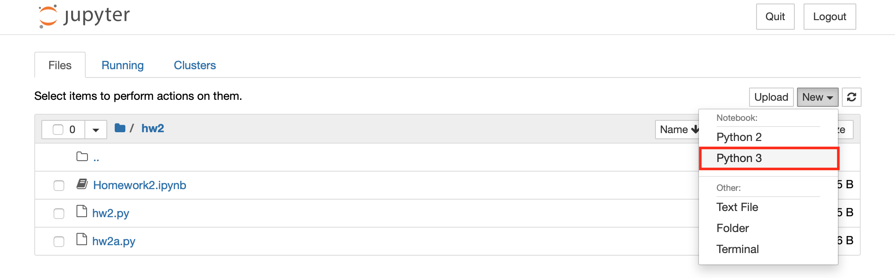
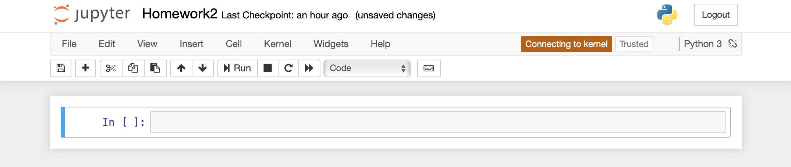
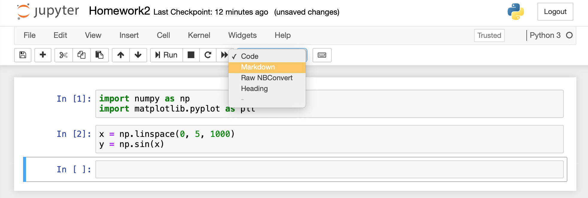
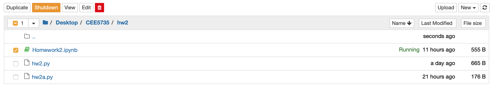

# Jupyter Notebook

### Starting Jupyter Notebook

Jupyter Notebook is one of the default applications on the Navigator homepage. Another way is to open Jupyter Notebook is by using Terminal; make sure that you are in the correct directory and then use the following command:

```bash
$ jupyter notebook
```

The Jupyter dashboard should open on your default web browser:



Navigate into your desired directory and then select _Python 3_ under _New_ to create a Python 3 Notework. This will open up an empty notebook, which you can then name by clicking on _Untitled_. To open a pre-existing notebook, simply click on the .iypnb file and make sure that the kernel is connected.



### Understanding Cells

Within a _**coding cell**_, you can write snippets of code. When you run a cell, the code is sent to a _**kernel**_ that executes it. Variables can be called or used from previously ran cells.


To run a cell, you can either click on the _Run_ button or use Ctrl/Command - Enter. A running cell is indicated by an asterisk. Once the cell has finished running, the asterisk is replaced by a number that tells you the number of cells that you have ran up to that point. 



Be careful about the order. Cells can be executed out of order or moved around and variables can be overwritten.


_**Markdown cells**_ allow you to add documentation to your code. Headings can be created using hashtags: \# Heading 1, \#\# Heading 2.



To run the markdown cell, click _Run_ or use Ctrl/Command - Enter.

### Stopping Jupyter Notebook

To shutdown a running notebook, exit the notebook, select the appropriate box from the directory, and click _Shutdown._



To exit Jupyter Notebook, click _Quit_ on the upper left corner or use Ctrl/Command - C in the Terminal.

### Limitations

There are times when coding with an IDE or text editor is preferable over using Jupyter Notebook. Here is a fun video about several limitations of Jupyter Notebook:



