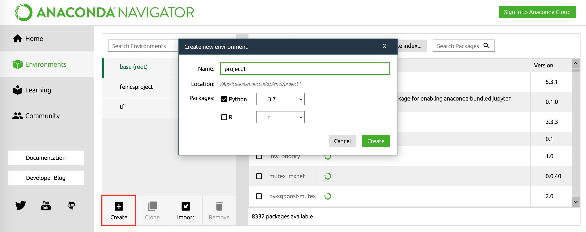
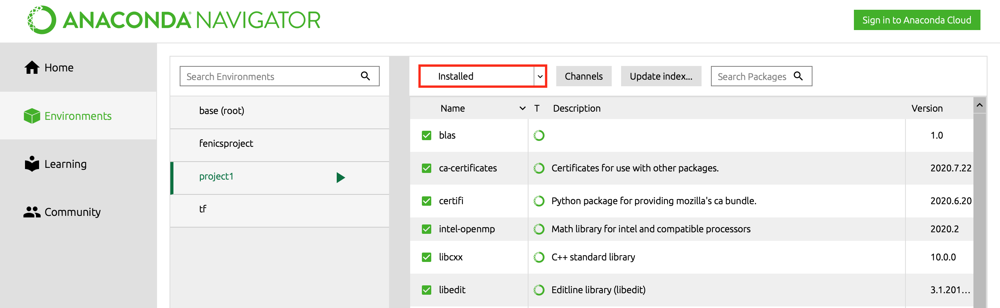
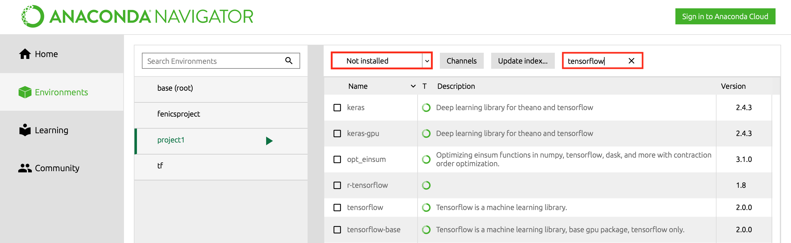
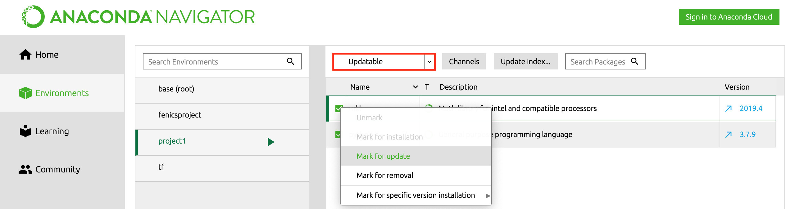

# Using Navigator

### Starting Navigator

Anaconda Navigator can be found on Launchpad \(Mac\) or start menu \(Windows\). Homepage displays applications, which can installed and then launched. We will be using Jupyter Notebook \(an interactive computational environment that is great for displaying code & results\) and Spyder \(Python IDE\) in this class.

### Creating Environment

Click on _Environments_ on the left navigation bar and then _create_ outlined in red. Name your environment and select the Python version.

The current environment is indicated with green. You can switch environments by clicking on tabs with the environment names.

### Managing Packages

We can filter the list of packages, shown on the right, to view the installed packages within the current environment.

To add a package in the current environment, switch to _Uninstalled_ and then perform a search for the package name in Anaconda Cloud. You do not need to sign in.

Select the packages you want to add and select _Apply_ on the bottom right. To perform a package update, filter for _Updatable_ packages and select them for updates.

### Opening Terminal‌

You can open a terminal by clicking the right arrow and selecting _Open Terminal_. This automatically activates the environment.


If you are on MacOS and using the zsh shell, you may get an error here. [Using Anaconda with zsh -&gt;](../../zsh.md)


