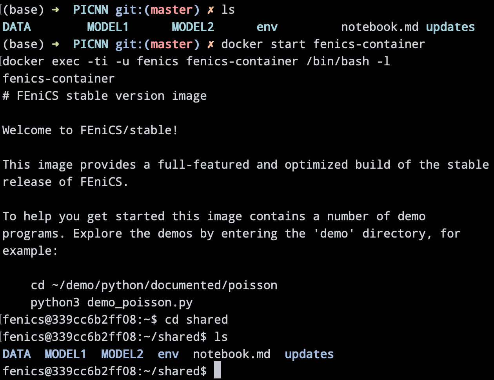

# Getting started

## On this page:

1. [Linux/MacOS](docker.md#linux-mac)
2. [Windows](docker.md#windows)
3. [Ubuntu](docker.md#ubuntu)

## Linux/Mac

#### Using Anaconda \(Recommended\)

The easiest way to use FEniCS is by creating and activating a conda environment containing the FEniCS package:

```text
conda create -n fenicsproject -c conda-forge fenics
source activate fenicsproject
```

#### Using Docker

Another way is to download the FEniCS Docker image and set up a Docker container. Please note that there are additional steps if you wish to use Jupyter Notebook inside a Docker container. 

Installing Docker is pretty straightforward on MacOS:



After installing Docker, download the FEniCS Docker image from your terminal: 

```text
curl -s https://get.fenicsproject.org | bash
```

Using this image, create a container named _fenics-container_ \(or name it however you like\) that shares files with your local directory:

```text
docker run -ti -v $(pwd):/home/fenics/shared --name fenics-container -p 127.0.0.1:8000:8000 quay.io/fenicsproject/stable
```

Navigate to your desired local directory and start the Docker container:

```text
docker start fenics-container
docker exec -ti -u fenics fenics-container /bin/bash -l
```

This is what you can expect on your terminal. Notice that the _shared_ directory in the container shares the same files as your local directory. 



Run your python scripts normally using _python3_. When you are finished, first exit the container using _exit,_ then stop the Docker container:

```text
docker stop fenics-container
```

## Windows

#### **Using Docker**

Docker for Windows requires Windows 10 [Pro/Enterprise/Education ](https://docs.docker.com/docker-for-windows/install/)or [Home](https://docs.docker.com/docker-for-windows/install-windows-home/). After installation, follow the steps above to create a FEniCS container. Docker for Windows can be a bit finicky since it uses Hyper-V or WSL2 to run the Linux images. If you've tried this installation and failed, I would recommend using Ubuntu.

#### **Using Ubuntu \(Recommended\)**

There are many ways to use Ubuntu on a Windows PC \(via virtual machine, dual booting, cloud, etc.\). If you don't have a preference, I would recommend setting up an Ubuntu virtual machine. 

First install Virtualbox:



Then follow these instructions to set up a Ubuntu virtual machine:



Finally, install FEniCS on the Ubuntu VM using the instructions in the Ubuntu section. 

## Ubuntu

Install FEniCS by running this on the terminal:

```text
sudo apt-get install software-properties-common
sudo add-apt-repository ppa:fenics-packages/fenics
sudo apt-get update
sudo apt-get install --no-install-recommends fenics
```


If line 4 fails, try running lines 3 and 4 again.


